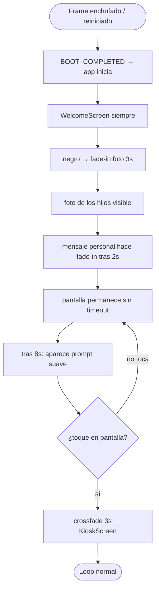
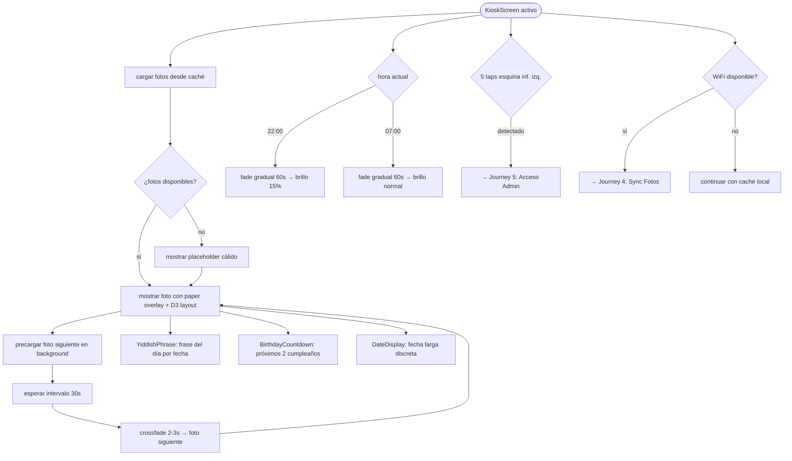
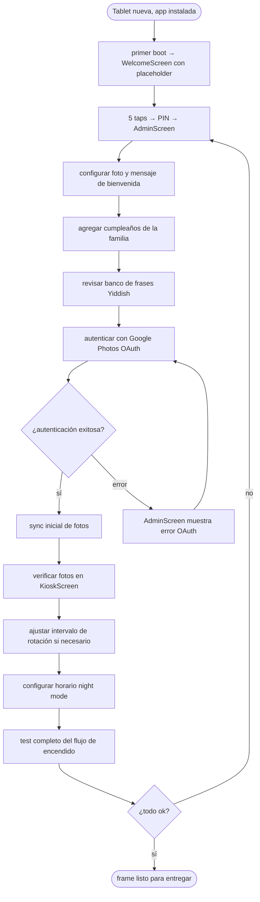
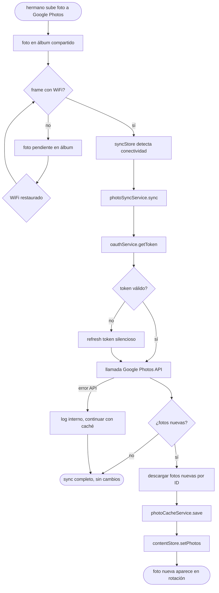
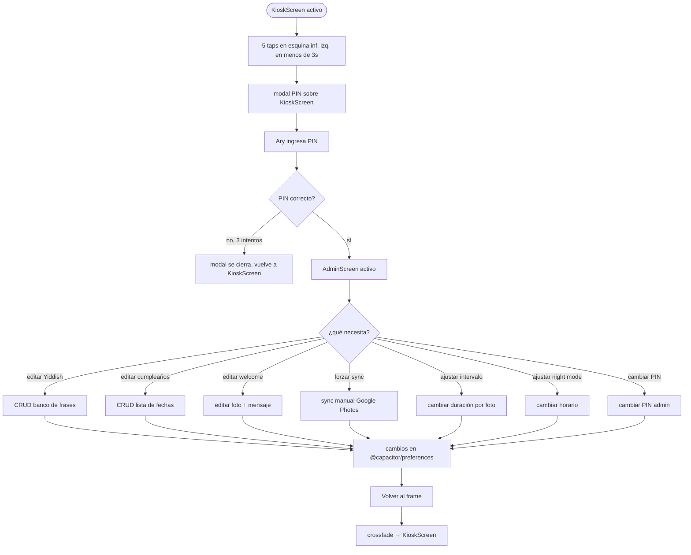
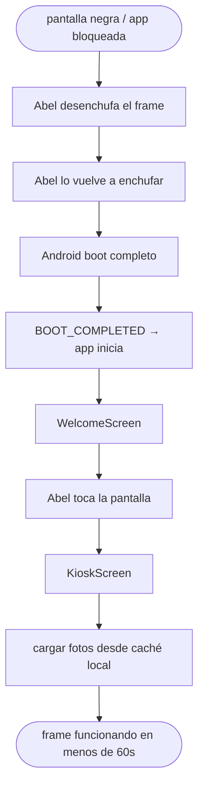

# UX Design Specification — family-frame

**Author:** Ary
**Date:** 2026-04-14

---

## Executive Summary

### Project Vision

family-frame es un objeto familiar, no una app. Un cuadro que respira en el hogar de Abel y Liliana, conectándolos pasivamente con su familia a través de fotos, el idioma de sus raíces y los momentos que se acercan. El regalo real ocurre en el primer encendido — una foto de sus hijos con un mensaje personal, aparece una sola vez, sin orquestación.

### Target Users

**Usuarios pasivos — Abel y Liliana (~70-80 años)**
No interactúan con el dispositivo. Lo habitan. Está en su visión periférica mientras toman café, mientras caminan por la casa. Leen en Yiddish con conexión emocional profunda. El diseño existe para ellos: fuentes grandes, alto contraste, calidez visual, sin urgencia.

**Usuarios activos — Ary y los hermanos**
Alimentan el frame desde sus propios dispositivos (Google Photos). Ary configura fechas, mensajes y ajustes desde el panel admin oculto. La experiencia admin debe ser completable en 2 minutos sin manual.

### Key Design Challenges

1. **Diseño para observación, no interacción** — la pantalla debe funcionar como obra de arte de pared a 2-3 metros, con dos modos simultáneos: periférico (¿es cálido? ¿no molesta?) y contemplativo (cuando algo los detiene a mirar)
2. **El momento del primer encendido** — Abel y Liliana encenderán el frame solos, sin Ary presente. El diseño debe ser emocionalmente autónomo: primer píxel = cara familiar, mensaje que funciona como carta, transición solo por toque deliberado (sin timeout)
3. **Legibilidad extrema** — fuente mínima 28-32px para welcome, 32-40px para texto secundario en kiosk, 56-72px para información primaria; contraste WCAG AA mínimo
4. **Composición del layout** — fotos + Yiddish + cumpleaños + fecha conviviendo sin sentirse un dashboard frío; jerarquía emocional (foto 75-80%), elementos secundarios como susurros al margen

### Design Opportunities

1. **Pantalla como cuadro familiar** — jerarquía emocional sobre informacional; la foto es el sujeto, todo lo demás son notas al margen con personalidad cálida
2. **Yiddish como hilo cultural** — tratamiento tipográfico distintivo, no texto utilitario; es el elemento identitario más poderoso del producto
3. **Night mode como señal de vida** — dimming gradual automático (22:00–07:00, ON por default) que hace que el frame "respire" con la casa; humanizante para esa generación
4. **Admin invisible pero poderoso** — la complejidad vive en el panel de Ary, la experiencia de Abel y Liliana es completamente pasiva y sin fricción

---

## Core User Experience

### Defining Experience

La experiencia central de family-frame es pasiva por diseño. Abel y Liliana no tienen
tareas que completar ni decisiones que tomar — su única "acción" es existir frente
al frame y dejarse alcanzar por él. La pantalla los encuentra a ellos, no al revés.

El ciclo de valor del producto:
1. Un hermano sube una foto al álbum compartido de Google Photos
2. La foto aparece en el frame sin intervención de nadie
3. Abel o Liliana la ven y sienten que su familia está cerca

Este ciclo, sin fricción, sin pasos intermedios, sin que nadie tenga que
"acordarse de hacer algo", es lo que define el éxito del producto.

### Platform Strategy

- **Plataforma:** Android tablet 14", landscape fijo, kiosk mode permanente
- **Interacción:** cero para usuarios pasivos; touch mínimo para Ary (admin oculto)
- **Offline-first:** toda la experiencia visible funciona sin WiFi; la red solo
  enriquece el caché en background
- **Siempre enchufado:** el frame opera como electrodoméstico — siempre conectado
  a la corriente, sin gestión de batería
- **Distancia de visualización:** 2-4 metros — diseño para pared, no para mano

### Effortless Interactions

Estas acciones deben ocurrir **sin que nadie haga nada:**

- Fotos nuevas aparecen automáticamente al reconectar WiFi
- La frase en Yiddish cambia cada día sin configuración
- Los cumpleaños próximos se calculan en tiempo real
- Night mode se activa y desactiva según la hora (22:00–07:00)
- El frame se recupera solo tras un corte de luz — sin wizard, sin configuración
- El token OAuth de Google Photos se renueva silenciosamente

La única interacción voluntaria del producto: el toque para salir de la welcome
screen. Una vez, en toda la vida del dispositivo.

### Critical Success Moments

1. **El primer encendido** — Abel o Liliana enchufan el frame, aparecen las caras
   de sus hijos. El mensaje personal. Sin Ary presente para explicar nada.
   Si este momento falla o se siente frío, el regalo falla.

2. **La primera foto nueva** — días después del regalo, aparece una foto que un
   hermano subió desde su celular. Sin aviso, sin coordinación. El frame
   simplemente la tiene. Ese momento confirma que el producto "está vivo."

3. **La frase en Yiddish** — Abel lee algo que le recuerda a su madre y llama
   a Ary para contárselo. El contenido generó conversación. Misión cumplida.

4. **Seis meses después** — el frame sigue funcionando. Nadie intervino.
   Nadie recibió llamadas de soporte. El producto desapareció de la mente
   de Ary, que es exactamente el objetivo.

### Experience Principles

1. **La pantalla es un cuadro, no una interfaz** — cada decisión de layout,
   tipografía y animación se evalúa como si fuera arte de pared, no una app

2. **Todo sucede sin pedírselo a nadie** — si algo requiere que el usuario
   recuerde hacer algo, es un defecto de diseño

3. **El contenido habla, la tecnología calla** — errores silenciosos, sin
   popups, sin notificaciones del sistema, sin indicadores técnicos en la
   pantalla principal

4. **El tiempo emocional no tiene urgencia** — transiciones lentas, sin timeouts
   forzados, sin animaciones nerviosas; el frame respeta el ritmo de las personas
   que lo miran

---

## Desired Emotional Response

### Primary Emotional Goals

**Para Abel y Liliana:**

El objetivo emocional central es **presencia** — la sensación de que la familia
está cerca aunque no estén físicamente en la habitación. No es nostalgia pasiva:
es conexión activa y continua con las personas que más quieren.

Las emociones secundarias que sostienen esa presencia:
- **Calidez** — ser recordado, ser querido, importar
- **Nostalgia positiva** — la frase en Yiddish que trae de vuelta voces del pasado
- **Anticipación dulce** — "en 3 días es el cumpleaños de Sofía"
- **Sorpresa suave** — una foto nueva que apareció sin que nadie avisara

**Para Ary y los hermanos:**
- **Pertenencia activa** — la satisfacción de poder "estar presentes" en la vida
  de sus padres desde lejos, con un gesto simple (subir una foto)
- **Confianza** — el frame sigue funcionando; nadie llamó a pedir ayuda

### Emotional Journey Mapping

| Momento | Emoción deseada |
|---------|----------------|
| Primer encendido: aparece la foto de los hijos | Sorpresa → reconocimiento → emoción profunda |
| Toque para continuar a las fotos | Calidez, transición suave, sin urgencia |
| Días cotidianos mirando el frame | Presencia silenciosa, placer periférico |
| Ver una foto nueva que apareció sola | Sorpresa dulce — "¿cuándo pusieron esto?" |
| Leer la frase en Yiddish del día | Reconocimiento cultural, nostalgia positiva, conexión |
| "En 3 días: cumpleaños de Sofía" | Anticipación, pertenencia familiar |
| Algo falla internamente | Indiferencia total — ni se enteran |
| 22:00 — pantalla se atenúa | Naturalidad; el frame "descansa" con ellos |

### Micro-Emotions

**A cultivar:**
- **Confianza** — el frame siempre está. Nunca falla visiblemente.
- **Pertenencia** — la familia los rodea en su propio hogar
- **Reconocimiento** — las caras familiares activan una respuesta inmediata y cálida
- **Continuidad** — el Yiddish conecta el presente con sus raíces

**A evitar absolutamente:**
- **Ansiedad** — ningún elemento parpadeante, urgente, o que demande atención
- **Confusión** — nada que no entiendan sin explicación
- **Intrusión** — la pantalla no interrumpe, no molesta, no exige
- **Frialdad tecnológica** — diseño que se sienta como gadget, no como hogar

### Design Implications

| Emoción objetivo | Decisión de diseño |
|-----------------|-------------------|
| Presencia → calidez | Paleta cálida (ambers, cremas), tipografía humana con personalidad, sin colores fríos de UI |
| Reconocimiento inmediato | Foto ocupa 75-80% — caras grandes y centradas desde el primer frame |
| Nostalgia positiva (Yiddish) | Tipografía distintiva para la frase — diferente del texto utilitario, como una cita |
| Confianza total | Errores 100% silenciosos; recuperación automática; nunca un mensaje de error visible |
| Sin ansiedad | Transiciones de 2-3 segundos; sin animaciones agresivas; sin timeout en welcome screen |
| El frame "respira" | Night mode gradual — fade de 60 segundos para atenuar, no corte brusco |

### Emotional Design Principles

1. **El frame nunca exige atención — la invita** — sin parpadeos, sin urgencia,
   sin elementos que "pidan ser leídos"; el contenido espera pacientemente

2. **Cada elemento visual debe ganarse su lugar emocional** — si un componente
   no genera calidez, pertenencia o conexión, no pertenece a la pantalla principal

3. **El primer encendido es irrepetible — diseñarlo como tal** — timing generoso,
   transiciones lentas, texto que funciona como carta sin autor presente

4. **La tecnología invisible es tecnología exitosa** — si Abel o Liliana notan
   que están "usando una app", algo salió mal en el diseño

---

## UX Pattern Analysis & Inspiration

### Inspiring Products Analysis

**Apple TV Screensaver / Google Chromecast Ambient Mode**
El estándar de pantalla pasiva en el hogar. Fotos a pantalla completa con
transiciones de crossfade largas y suaves, información mínima o inexistente.
Lo que hacen bien: la pantalla "desaparece" — lo único que existe es la imagen.
Patrón clave: contenido sin chrome, sin UI visible, sin elementos que compitan
con la foto.

**Nixplay / Aura (marcos digitales)**
Referencia directa del dominio. Lo que hacen bien: sync automático, layouts
limpios, transiciones fluidas. Lo que hacen mal: se sienten como producto
tecnológico — menús visibles, indicadores de estado, notificaciones. El error
fundamental es tratar el frame como una app con usuario activo.
Anti-patrón clave: UI que recuerda que estás mirando una pantalla.

**Amazon Echo Show (modo ambiental)**
Modelo de convivencia entre foto principal + información contextual secundaria.
La foto domina, los datos (clima, hora) viven en un margen discreto sin competir.
Patrón clave: jerarquía clara donde la imagen es siempre el protagonista.

**Kindle Paperwhite (screensavers)**
La inspiración más relevante para family-frame. Una imagen de alta calidad que
"descansa" en la pantalla — sin parecer interfaz, sin brillo agresivo, con la
calidez visual del papel impreso. El filtro de pantalla del Kindle transforma
contenido digital en algo que se siente físico y permanente.
Patrón clave: tratamiento visual que elimina la "frialdad digital."

### Transferable UX Patterns

**Patrón visual — Linen/Paper Overlay**
Encima de cada foto, una textura de papel muy sutil (5-8% de opacidad) + leve
desaturación + temperatura cálida. Reduce el brillo agresivo del LCD, transforma
la pantalla en objeto de hogar, y alinea con la sensación de álbum familiar
físico. Implementación: CSS `filter` sobre `PhotoSlide` + overlay texture PNG.
Intensidad exacta a validar con pruebas en el dispositivo real.

**Patrón de transición — Crossfade lento**
Transición entre fotos por crossfade de 2-3 segundos. Sin cortes, sin slides,
sin efectos. La imagen siguiente emerge sobre la anterior como una revelación,
no como un cambio de canal. Estándar en Apple TV, Chromecast Ambient.

**Patrón de layout — Contenido sin chrome**
La foto ocupa la pantalla completa. Los elementos de texto (Yiddish, cumpleaños,
fecha) viven en una banda inferior semi-transparente que se superpone a la foto
sin enmarcarse en un panel separado. La pantalla no tiene "áreas de UI" — tiene
una sola imagen con susurros encima.

**Patrón de tipografía — Jerarquía por peso, no por área**
Del Kindle: una sola fuente con personalidad, en distintos pesos. El Yiddish
con tratamiento de cita (cursiva suave o fuente serif), la fecha y cumpleaños
en sans-serif del mismo sistema pero más ligera.

**Patrón de interacción — Touch como excepción, no como norma**
Del Chromecast Ambient: el dispositivo no espera interacción. El toque en la
welcome screen es la única excepción intencional en todo el producto.

### Anti-Patterns to Avoid

- **Indicadores de estado visibles** (spinner de sync, ícono de WiFi, "última
  actualización") — rompen la ilusión de objeto de hogar; todo proceso técnico
  es invisible para Abel y Liliana
- **Transiciones abruptas o rápidas** — cortes de menos de 1 segundo entre fotos;
  cualquier animación que llame la atención sobre sí misma
- **Paleta azul/blanca fría** — el vocabulario visual de las apps de productividad;
  incompatible con calidez emocional
- **Texto sobre fondo blanco liso** — demasiado clínico; el texto vive sobre la
  foto con overlay semi-transparente cálido
- **Múltiples fotos simultáneas** (collage, grid) — compite con la jerarquía
  emocional; una foto a la vez, siempre
- **Elementos con bordes definidos / tarjetas / sombras de UI** — fragmentan la
  pantalla; todo debe fluir como una sola composición

### Design Inspiration Strategy

**Adoptar:**
- Pantalla completa sin chrome — estándar Apple TV / Chromecast
- Crossfade lento como única transición entre fotos
- Linen/paper texture overlay (5-8% opacidad) + desaturación suave — dirección
  Kindle Paperwhite; intensidad final a validar en dispositivo real

**Adaptar:**
- Modo ambiental Echo Show → aplicar a la banda de texto inferior: Yiddish +
  cumpleaños + fecha sobre overlay semi-transparente cálido, no panel separado
- Night mode → extender con el filtro paper; de noche el frame se vuelve
  aún más cálido y tenue

**Evitar:**
- Cualquier patrón de Nixplay/Aura que exponga UI técnica al usuario pasivo
- Grids o collages de múltiples fotos
- Colores fríos o elementos con bordes de tarjeta

---

## 2. Core User Experience

### 2.1 Defining Experience

**Experiencia #1 — El primer encendido (única, irrepetible)**

> "Enchufo el frame. La pantalla enciende. Veo las caras de mis hijos."

Abel o Liliana conectan el cable. Sin configuración, sin decisiones. La pantalla
emerge desde el negro mostrando la foto de sus hijos con un mensaje personal.
Lo leen solos, sin que nadie les explique nada. Tocan la pantalla cuando están
listos. El frame pasa a las fotos familiares y ese momento nunca vuelve.

Este es el regalo. Todo lo demás son los meses que siguen.

**Experiencia #2 — La presencia diaria (continua, pasiva)**

> "Paso frente al frame, veo una foto que no había visto antes. Me detengo."

El frame existe. No pide nada. Una foto nueva apareció sola. La frase de hoy
en Yiddish es una que conocían de chicos. En tres días es el cumpleaños de Sofía.
Nadie configuró nada. El frame simplemente sabe.

**Experiencia #3 — Contribuir desde lejos (activa, para Ary y hermanos)**

> "Saqué una foto en la cena del domingo. La subí al álbum. Aparecerá en el frame."

Un hermano sube una foto a Google Photos desde su celular. Sin apps adicionales,
sin notificaciones, sin coordinación. El frame la incorpora solo al reconectar WiFi.

### 2.2 User Mental Model

**Abel y Liliana — sin modelo previo**
Probablemente no han usado un marco digital antes. Su modelo mental es el del
álbum de fotos físico o el portarretratos: "es una foto que está ahí, siempre."
La diferencia es que este cambia solo — y eso es el único concepto nuevo que
necesitan absorber, sin que nadie se los explique.

Implicación de diseño: no hay curva de aprendizaje. El frame no requiere que
entiendan nada. El primer toque en la welcome screen es el único gesto que
se les pide, y tiene un prompt visible y claro.

**Ary y hermanos — modelo Google Photos**
El modelo mental es claro: álbum compartido = fuente de fotos del frame.
No es un concepto nuevo — ya lo usan para compartir fotos entre ellos.
La única adición es "lo que subís aparece en el frame de los viejos."

### 2.3 Success Criteria

**Welcome screen:**
- Abel o Liliana reconocen las caras en menos de 2 segundos
- La reacción emocional ocurre antes de leer el texto
- El prompt "tocar para continuar" es encontrado sin buscar
- La transición al modo kiosk se siente como el inicio de algo, no el fin

**Experiencia diaria:**
- El frame nunca interrumpe ni demanda atención
- Cuando Abel se detiene a mirarlo, siempre hay algo que vale la pena leer
- Ningún elemento genera confusión o pregunta "¿qué es eso?"
- Una foto nueva aparece al menos cada semana sin intervención de Ary

**Contribución familiar:**
- Un hermano sin instrucciones puede agregar fotos en menos de 3 minutos
- Las fotos aparecen en el frame dentro de las 24 horas de ser subidas

### 2.4 Novel UX Patterns

**Lo que es genuinamente nuevo en este diseño:**

- **Diseño para observación pasiva sostenida** — la mayoría de los productos
  digitales asumen que el usuario está mirando activamente. family-frame asume
  que el usuario NO está mirando, y diseña para el momento en que casualmente sí.
  No hay precedente directo en UX de apps; el referente más cercano es el diseño
  de arte de pared e instalaciones en museos.

- **One-shot onboarding emocional** — el "primer encendido" no es un tutorial
  ni una bienvenida funcional. Es un acto teatral que ocurre exactamente una vez.
  No existe el concepto de "retry" o "volver a ver". El diseño de este momento
  tiene más en común con el teatro que con el UX tradicional.

**Lo que usa patrones establecidos:**
- Sync automático con servicio externo (Google Photos) — patrón conocido
- Admin oculto con gesto + PIN — patrón estándar en sistemas kiosk
- Night mode por horario — patrón establecido en smart displays

### 2.5 Experience Mechanics

#### Mecánica del primer encendido

| Fase | Acción | Respuesta del sistema |
|------|--------|----------------------|
| Inicio | Abel enchufa el frame | BOOT_COMPLETED → app inicia → `firstBootCompleted` = false |
| Apertura | Pantalla enciende | Negro absoluto → fade-in de 3s: foto de los hijos ocupa 65% |
| Revelación | — (espera) | Tras 2s: mensaje personal hace fade-in debajo de la foto |
| Espera | Abel y Liliana leen, sienten | Pantalla permanece. Sin timeout. Sin urgencia. |
| Invitación | — | Tras 8s del mensaje: aparece prompt suave "Tocar para ver las fotos" |
| Transición | Toque en cualquier parte | `firstBootCompleted` = true → crossfade 3s a KioskScreen |
| Fin | KioskScreen activo | Primera foto familiar. Modo normal para siempre. |

#### Mecánica del loop diario (KioskScreen)

| Elemento | Comportamiento |
|----------|---------------|
| Foto | Crossfade cada 30s (configurable). Pre-carga silenciosa de la siguiente. |
| InfoBand | Siempre visible en banda inferior. Opacity: 0.85. |
| Yiddish | Cambia una vez por día (basado en fecha local). Tipografía display. |
| Cumpleaños | Muestra los próximos 2 cumpleaños con días restantes. Actualización en tiempo real. |
| Fecha | Formato largo y cálido: "Lunes, 14 de abril". Kiosk-sm, opacity reducida. |
| Night mode | 22:00: fade gradual 60s → 15% brillo. 07:00: fade inverso 60s → normal. |

#### Mecánica del acceso admin

| Paso | Detalle |
|------|---------|
| Activación | 5 taps consecutivos en esquina inferior izquierda (< 3s entre taps) |
| Autenticación | Modal de PIN sobre KioskScreen — no navega fuera de la app |
| Admin activo | AdminScreen reemplaza KioskScreen — fondo oscuro, UI funcional |
| Salida | Botón "Volver al frame" → crossfade de regreso a KioskScreen |

---

## Design System Foundation

### Design System Choice

**Sistema custom sobre Tailwind CSS** — sin librería de componentes pre-construida.

Tailwind ya está en el stack (arquitectura definida). Para family-frame, adoptar
un sistema establecido (Material Design, Chakra UI, Ant Design) sería contraproducente:
estos sistemas están optimizados para apps con usuarios activos, navegación y
formularios — exactamente lo que no somos. Cada componente estándar tendría que
sobreescribirse para eliminar chrome de UI, bordes de tarjeta y comportamientos
interactivos que no necesitamos.

### Rationale for Selection

1. **Tailwind ya está en el stack** — sin dependencias adicionales, sin overhead
2. **El diseño es fundamentalmente visual, no interactivo** — no necesitamos un
   sistema de componentes complejos; necesitamos tokens de color, tipografía y
   espaciado bien definidos
3. **Libertad total para el paper overlay y la paleta cálida** — cualquier
   librería de componentes traería defaults visuales que pelearían con nuestra
   dirección estética
4. **1 solo desarrollador, timeline corto** — un sistema liviano es más rápido
   de dominar y mantener que una librería externa con sus propias convenciones

### Implementation Approach

**Design tokens en `tailwind.config.ts`** — fuente de verdad de todo el sistema:

- **Paleta cálida:** cream `#F5F0E8`, amber `#C8956C`, sepia `#8B6F5E`,
  charcoal `#2C2420`, night `#1A1210`
- **Tipografía:** Playfair Display (serif) para Yiddish y títulos welcome;
  Inter (sans-serif) para fecha, cumpleaños y admin
- **Escala kiosk:** tamaños 32px / 40px / 56px / 72px diseñados para lectura
  a 2-4 metros de distancia

**Componentes del sistema (solo los necesarios):**
- `PhotoSlide` — imagen full-screen con paper overlay CSS
- `YiddishPhrase` — tipografía display, tratamiento de cita
- `BirthdayCountdown` — tipografía body, kiosk-md
- `DateDisplay` — tipografía body, kiosk-sm, opacity reducida
- `InfoBand` — overlay semi-transparente inferior donde viven los 3 elementos
- `WelcomeCard` — layout centrado para el primer encendido
- `PinEntry` — único componente interactivo del sistema (solo en admin)

### Customization Strategy

**Paper overlay** — implementado como CSS puro en `PhotoSlide`:
- `filter: saturate(0.85) brightness(0.95) sepia(0.08)` como baseline
- PNG de textura linen al 5-8% de opacidad sobre la foto
- Intensidad exacta a definir con pruebas en dispositivo real

**Modo noche** — clase `.night-mode` aplicada al root:
- Brillo de ventana via `@capacitor-community/screen-brightness`
- Overlay CSS adicional `rgba(20, 10, 5, 0.3)` para warmth extra nocturno

**Admin** — contexto aislado donde se permiten componentes interactivos
estándar (Tailwind forms + headlessui) sin conflicto con el diseño del kiosk

---

## Visual Design Foundation

### Color System

**Paleta principal — "Hogar cálido"**

| Token | Hex | Uso |
|-------|-----|-----|
| `frame-cream` | `#F5F0E8` | Fondo base, texto sobre oscuro |
| `frame-amber` | `#C8956C` | Acento cálido, prompt de toque |
| `frame-sepia` | `#8B6F5E` | Texto secundario, fecha |
| `frame-charcoal` | `#2C2420` | Texto primario sobre fondos claros |
| `frame-night` | `#1A1210` | Fondo modo noche, overlays profundos |
| `frame-overlay` | `rgba(28, 18, 12, 0.72)` | InfoBand semi-transparente sobre foto |
| `frame-paper` | `rgba(245, 235, 210, 0.06)` | Linen overlay sobre fotos |

**Semántica de color:**
- **Primario:** `frame-amber` — el único acento visible (prompt welcome, detalles admin)
- **Superficies:** `frame-overlay` para InfoBand; `frame-night` para admin y modals
- **Texto sobre foto:** `frame-cream` (peso normal) + `frame-amber` (énfasis)
- **Modo noche:** overlay adicional `rgba(20, 10, 5, 0.30)` sobre toda la UI

**Contraste WCAG AA verificado:**
- `frame-cream` sobre `frame-overlay` → ratio estimado ~9:1 ✅
- `frame-cream` sobre `frame-night` → ratio estimado ~12:1 ✅
- `frame-amber` sobre `frame-night` → ratio estimado ~5:1 ✅

### Typography System

**Dos familias, roles distintos:**

**Playfair Display** (serif, Google Fonts)
- Rol: Yiddish, títulos de la welcome screen, citas
- Pesos: 400 para Yiddish cotidiano, 700 para welcome title

**Inter** (sans-serif, Google Fonts)
- Rol: fecha, cumpleaños, admin, mensajes funcionales
- Pesos: 300 para fecha, 500 para cumpleaños, 600 para admin

**Escala tipográfica kiosk** (diseñada para 2-4 metros de distancia):

| Token | Tamaño | Fuente | Peso | Uso |
|-------|--------|--------|------|-----|
| `kiosk-date` | 28px | Inter | 300 | Fecha del día — discreta |
| `kiosk-birthday` | 36px | Inter | 500 | Cumpleaños próximos |
| `kiosk-yiddish` | 52px | Playfair | 400 | Frase Yiddish principal |
| `kiosk-transliteration` | 24px | Inter | 300 | Transliteración / traducción |
| `welcome-title` | 64px | Playfair | 700 | Título welcome screen |
| `welcome-message` | 28px | Inter | 400 | Mensaje personal — line-height 1.7 |
| `welcome-prompt` | 22px | Inter | 300 | "Tocar para ver las fotos" |

**Notas:** preload de ambas fuentes en `index.html`; `font-display: swap` para
evitar texto invisible en carga inicial.

### Spacing & Layout Foundation

**Sistema base 4px (Tailwind estándar)**

| Uso | Valor | Tailwind |
|-----|-------|----------|
| InfoBand padding vertical | 20px | `py-5` |
| InfoBand padding horizontal | 32px | `px-8` |
| Separación entre elementos InfoBand | 16px | `gap-4` |
| Padding interno WelcomeCard | 48px | `p-12` |
| Gap entre foto y mensaje welcome | 24px | `gap-6` |

**Layout KioskScreen (landscape 14"):**
```
┌─────────────────────────────────────────────────────┐
│                                                      │
│              FOTO (100% width, ~85% height)          │
│           con paper overlay + crossfade              │
│                                                      │
├──────────────────────────────────────────────────────┤
│  Frase en Yiddish            Cumpleaños  │  Fecha   │
│  Transliteración                         │           │
│  ←── InfoBand overlay rgba (~15% height) ──────────→│
└─────────────────────────────────────────────────────┘
```

**Layout WelcomeScreen:**
```
┌─────────────────────────────────────────────────────┐
│                 negro → fade-in 3s                   │
│         ┌────────────────────────────┐               │
│         │   FOTO DE LOS HIJOS (65%)  │               │
│         └────────────────────────────┘               │
│         Mensaje personal (28px, lh 1.7)              │
│              [Tocar para ver las fotos]              │
└─────────────────────────────────────────────────────┘
```

**Principios:** sin márgenes decorativos, la foto llega a los bordes, InfoBand
en `position: absolute`, todo en unidades relativas (`vw`, `vh`, `%`).

### Accessibility Considerations

- Todos los textos sobre overlay verificados ≥ 4.5:1 (WCAG AA)
- Tamaño mínimo visible: 22px — supera el estándar de 16px
- Jerarquía por tamaño y tipografía, no solo por color
- Tap targets: "toda la pantalla" (welcome) y "esquina inferior izquierda amplia" (admin)
- Night mode reduce molestia visual nocturna sin comprometer contraste

---

## Design Direction Decision

### Design Directions Explored

KioskScreen: 6 variantes exploradas (Cuadro Clásico, Cinema, Mural, Split Panel,
Minimalista, Borde Cálido). WelcomeScreen: 2 variantes (Centrado Clásico, Dramático).
Showcase interactivo en `_bmad-output/planning-artifacts/ux-design-directions.html`.

### Chosen Direction

**KioskScreen: D3 — "Mural"**
Texto flotado directamente sobre la foto, sin panel ni InfoBand. Yiddish grande
en esquina inferior izquierda. Fecha en esquina superior derecha (muy discreta).
Cumpleaños en esquina inferior derecha. La foto respira al 100% — nada la enmarca.

**WelcomeScreen: W2 — "Dramático"**
Foto full-bleed desde el primer píxel. Mensaje personal y prompt sobre degradado
oscuro en la mitad inferior. Máximo impacto emocional en el momento del primer
encendido.

### Design Rationale

D3 es la dirección que más fielmente realiza el principio "la pantalla es un cuadro,
no una interfaz." El texto existe sobre la imagen como si siempre hubiera estado
ahí — como un subtítulo de cine, no como una barra de UI.

W2 potencia el momento teatral del primer encendido: Abel o Liliana enchufan el
frame y la primera cosa que ven es la cara de sus hijos llenando toda la pantalla.
El texto aparece después, sobre la imagen, como si emergiera de ella.

### Implementation Approach

**Legibilidad en D3 — estrategia de mitigación:**

1. `text-shadow: 0 2px 16px rgba(0,0,0,0.7), 0 1px 4px rgba(0,0,0,0.5)` sobre
   cada elemento de texto — funciona sobre cualquier fondo, claro u oscuro
2. Gradiente localizado muy sutil en esquinas de texto:
   `radial-gradient` de `rgba(0,0,0,0.25)` en esquina inferior izquierda y
   esquina inferior derecha — imperceptible en fotos oscuras, protector en claras
3. Monitorear legibilidad durante testing con el banco de fotos real de la familia
4. Si hay fotos muy claras problemáticas: ajustar text-shadow o añadir
   `backdrop-filter: blur` sutil en la zona de texto

**WelcomeScreen — contraste garantizado:**
El gradiente `linear-gradient(to bottom, transparent → rgba(10,5,2,0.85))`
garantiza contraste suficiente para cualquier foto elegida como welcome image.

---

## User Journey Flows

### Journey 1 — Encendido del Frame (cada reinicio)

Abel o Liliana enchufan el frame — ya sea la primera vez o después de un corte
de luz. Siempre ven la pantalla de bienvenida antes de pasar a las fotos.

**Decisión de diseño:** la WelcomeScreen aparece en cada boot, no solo la primera
vez. Cada encendido es un recordatorio cálido del regalo de aniversario.
Simplificación arquitectónica: se elimina el flag `firstBootCompleted` de la
lógica de display — `App.tsx` siempre arranca con WelcomeScreen.



### Journey 2 — Loop Diario (KioskScreen)



### Journey 3 — Setup Inicial (Ary)



### Journey 4 — Sync de Fotos (automático)



### Journey 5 — Acceso Admin (Ary)



### Journey 6 — Recuperación de Error (Abel)



### Journey Patterns

**Recuperación silenciosa:** todos los errores técnicos se capturan en servicios,
se loguean internamente, y la UI continúa con el último estado válido.

**Crossfade universal:** toda navegación entre screens usa crossfade de 2-3s.

**Estado persistente:** token OAuth, fotos cacheadas, cumpleaños y frases Yiddish
sobreviven cualquier reinicio.

### Flow Optimization Principles

1. **Cero pasos para Abel y Liliana** — ningún journey del usuario pasivo
   requiere acción más allá del toque inicial en la WelcomeScreen
2. **Fail-safe visible solo para Ary** — AdminScreen es el único lugar con
   feedback técnico y mensajes de error
3. **Recuperación por reinicio** — ante cualquier problema, desenchufar y
   enchufar es la solución completa en menos de 60 segundos

---

## Component Strategy

### Componentes Personalizados — Catálogo Completo

Todos los componentes son custom (no biblioteca de componentes). Tailwind CSS para
estilos, Zustand para estado global, Capacitor para acceso nativo.

---

#### PhotoSlide

**Responsabilidad:** Mostrar una foto con paper overlay, manejar el crossfade a la siguiente, precargar la siguiente foto en background.

**Props:**
```typescript
interface PhotoSlideProps {
  src: string;           // URL o path local de la foto activa
  nextSrc?: string;      // URL para precarga en background
  duration?: number;     // ms que dura visible (default: 30000)
  onNext: () => void;    // callback cuando termina el intervalo
}
```

**Comportamiento:**
- `position: absolute; inset: 0` — ocupa toda la pantalla
- Paper overlay: `filter: saturate(0.85) sepia(0.08)` + PNG texture 5-8% opacity
- Crossfade 2-3s entre fotos: CSS opacity transition en dos capas superpuestas
- Prefetch de `nextSrc` con `<link rel="prefetch">` silencioso
- Si `src` falla: mantiene foto anterior (no muestra roto ni placeholder)

**Estado:**
- `useContentStore()` → `photos[]`, `currentIndex`
- No gestiona timer internamente — recibe `duration` y llama `onNext`

---

#### YiddishPhrase

**Responsabilidad:** Mostrar la frase en Yiddish del día con su transliteración/traducción, posicionada en esquina inferior izquierda (D3 layout).

**Props:**
```typescript
interface YiddishPhraseProps {
  phrase: YiddishEntry;  // { yiddish, transliteration, spanish }
}
```

**Comportamiento:**
- `position: absolute; bottom: 20px; left: 32px`
- Frase Yiddish: `52px Playfair Display 400` con text-shadow multicapa
- Transliteración: `24px Inter 300` con menor opacity (0.85)
- Gradiente radial muy sutil en esquina inferior izquierda (protección D3)
- Frase determinada por `dayOfYear % phrases.length` — cambia a medianoche

**Estado:** `useContentStore()` → `yiddishPhrases[]`, `todayPhrase`

---

#### BirthdayCountdown

**Responsabilidad:** Mostrar los próximos 1-2 cumpleaños con cuenta regresiva en días, posicionado en esquina inferior derecha.

**Props:**
```typescript
interface BirthdayCountdownProps {
  birthdays: BirthdayEntry[];  // hasta 2 próximos
}
```

**Comportamiento:**
- `position: absolute; bottom: 20px; right: 32px; text-align: right`
- Formato: `"En X días: cumpleaños de Sofía"` — `36px Inter 500`
- Si cumpleaños es hoy: `"🎂 Hoy: cumpleaños de Sofía"` — `amber` highlight
- Máximo 2 entradas visibles; si hay más, rotan con el ciclo de fotos
- Oculto si no hay cumpleaños en los próximos 30 días

**Estado:** `useContentStore()` → `birthdays[]`, computed `upcomingBirthdays`

---

#### DateDisplay

**Responsabilidad:** Mostrar la fecha del día de forma discreta en esquina superior derecha.

**Props:** ninguno (lee de estado global)

**Comportamiento:**
- `position: absolute; top: 20px; right: 32px`
- Formato largo: `"Martes, 12 de Mayo de 2026"` — `28px Inter 300`
- `opacity: 0.7` — presencia discreta, no compite con el contenido principal
- Text-shadow mínimo para legibilidad sobre fotos claras
- Actualización automática a medianoche (suscripción a `dateStore`)

**Estado:** `useDateStore()` → `formattedDate`, `locale: 'es-AR'`

---

#### GestureDetector

**Responsabilidad:** Detectar el gesto oculto de acceso admin (5 taps en esquina inferior izquierda en menos de 3 segundos).

**Props:**
```typescript
interface GestureDetectorProps {
  onAdminGesture: () => void;  // callback cuando gesto detectado
  children: React.ReactNode;
}
```

**Comportamiento:**
- Wrapper invisible sobre toda la KioskScreen
- Zona sensible: `64x64px` en esquina inferior izquierda
- Conteo de taps con timeout de 3s para resetear
- Sin feedback visual mientras se detecta (secreto)
- Al completar 5 taps: llama `onAdminGesture()` inmediatamente

**Estado:** local (`useRef` para contador y timestamp)

---

#### PinEntry

**Responsabilidad:** Modal de entrada de PIN que aparece sobre la KioskScreen antes de dar acceso al AdminScreen.

**Props:**
```typescript
interface PinEntryProps {
  onSuccess: () => void;
  onCancel: () => void;
  maxAttempts?: number;  // default: 3
}
```

**Comportamiento:**
- Modal centrado con backdrop `rgba(0,0,0,0.85)`
- Teclado numérico virtual de 10 dígitos (sin confiar en teclado del sistema)
- Indicador de dígitos: `● ● ● ●` (puntos, no los números)
- 3 intentos fallidos → cierra modal, vuelve a KioskScreen sin mensaje de error
- No muestra qué fue incorrecto (seguridad)
- `Inter 600` para botones del teclado, `touch-target: min 48x48px`
- PIN almacenado en `@capacitor/preferences` (no hardcodeado)

**Estado:** local + `useAdminStore()` para verificar PIN

---

#### WelcomeScreen

**Responsabilidad:** Pantalla de bienvenida que aparece en cada boot. Foto full-bleed, mensaje personal y prompt de interacción (dirección W2 — Dramático).

**Props:** ninguno (lee de estado global)

**Comportamiento:**
- Full-screen, `position: fixed; inset: 0; background: #1A1210`
- Foto cargada desde `welcomeConfig.photoPath` (caché local)
- Fade-in desde negro a foto: 3s opacity transition al montar
- Mensaje personal aparece con fade-in 1s tras 2s de foto visible
- Gradiente inferior: `linear-gradient(to bottom, transparent, rgba(10,5,2,0.85))`
  garantiza contraste del texto sobre cualquier foto
- Prompt `"Tocar para ver las fotos"` aparece tras 8s: `22px Inter 300`
- Toque en cualquier parte de la pantalla → crossfade 3s a KioskScreen
- Sin timeout automático — espera el toque indefinidamente

**Estado:** `useContentStore()` → `welcomeConfig { photoPath, message, authorName }`

---

#### AdminScreen

**Responsabilidad:** Pantalla de configuración completa para Ary. Accesible solo tras autenticación con PIN.

**Secciones:**
1. **Bienvenida** — editar foto y mensaje de la WelcomeScreen
2. **Frases Yiddish** — CRUD del banco de frases (yiddish + transliteración + español)
3. **Cumpleaños** — CRUD de fechas con nombres
4. **Fotos** — estado sync Google Photos, forzar sync manual, ver fotos cacheadas
5. **Configuración** — intervalo de rotación, horario night mode, cambio de PIN
6. **Sistema** — reiniciar app, ver logs básicos, estado OAuth

**Comportamiento:**
- `Inter` en todo, tamaños normales (no kiosk scale) — es para Ary en mano
- Botones con `min-height: 48px` para usabilidad táctil
- Formularios simples: input texto + botones Guardar/Cancelar
- Feedback inmediato: toast de confirmación tras guardar (`2s, color amber`)
- "Volver al frame" en header: crossfade 2s → KioskScreen

**Estado:** `useAdminStore()`, `useContentStore()`, `useSyncStore()`

---

### Component Implementation Strategy

**Principios de arquitectura de componentes:**

1. **Composición sobre herencia** — KioskScreen compone PhotoSlide + YiddishPhrase
   + BirthdayCountdown + DateDisplay + GestureDetector como capas superpuestas
2. **Estado en Zustand, no en props** — componentes de display leen el store directamente;
   solo los callbacks suben por props
3. **Posicionamiento absoluto** — todos los overlays usan `position: absolute` con
   coordenadas explícitas; evita flexbox en la capa de kiosk para máximo control
4. **Sin efectos visuales del sistema** — todos los componentes usan `user-select: none`
   y `-webkit-tap-highlight-color: transparent`

### Roadmap de Implementación

**Fase 1 — Core kiosk (semana 1-2):**
PhotoSlide + YiddishPhrase + DateDisplay + BirthdayCountdown → loop visual completo

**Fase 2 — Flujo completo (semana 2-3):**
WelcomeScreen + GestureDetector + PinEntry + AdminScreen básico
→ flujo completo de boot a admin funcional

**Fase 3 — Integración y polish (semana 3-4):**
Google Photos OAuth + sync service + night mode + pixel shifting
→ feature-complete, listo para testing en dispositivo real

---

## UX Consistency Patterns

### Transiciones y Animaciones

**Principio universal: crossfade, nunca cortes ni slides.**

| Contexto | Duración | Easing | Notas |
|----------|----------|--------|-------|
| Cambio de foto (KioskScreen) | 2-3s | `ease-in-out` | Dos capas opacity: 1→0 y 0→1 simultáneas |
| WelcomeScreen → KioskScreen | 3s | `ease-in-out` | Tras toque del usuario |
| KioskScreen → modal PIN | 0.3s | `ease-out` | backdrop fade-in |
| PIN → AdminScreen | 0.5s | `ease-in-out` | Crossfade completo |
| AdminScreen → KioskScreen | 2s | `ease-in-out` | Vuelta suave al frame |
| Fade-in welcome inicial | 3s | `ease-in` | Desde negro puro |
| Night mode dimming | 60s | `linear` | Degradado gradual, imperceptible |

**Regla:** ninguna transición es instantánea. El frame es un objeto físico; sus cambios deben sentirse orgánicos.

---

### Patrones de Feedback

**En KioskScreen: cero feedback.**
La pantalla nunca reconoce toques, errores de red, ni estados de carga. Si hay un
problema técnico, el contenido cacheado continúa silenciosamente.

**En AdminScreen: feedback inmediato y claro.**

| Situación | Patrón | Duración | Color |
|-----------|--------|----------|-------|
| Acción guardada exitosamente | Toast inferior: `"Guardado ✓"` | 2s, desaparece solo | `frame-amber` |
| Sync Google Photos completado | Toast: `"X fotos nuevas sincronizadas"` | 3s | `frame-amber` |
| Error de red / OAuth | Toast: `"Sin conexión — usando caché"` | 4s | `sepia` (no rojo) |
| PIN incorrecto (sin superar límite) | Shake sutil en puntos del PIN | — | — |
| 3 intentos PIN agotados | Modal se cierra sin mensaje | — | Silencio intencional |
| Campo vacío al intentar guardar | Border `frame-amber` en el campo | Mientras esté vacío | — |

**Principio:** los errores no alarman. Ni rojo, ni iconos de peligro, ni mayúsculas.
El tono siempre es cálido y resolutivo.

---

### Patrones de Formularios (AdminScreen)

**Campo de texto estándar:**
- `Inter 400 16px`, padding `12px 16px`, border `1px solid frame-sepia/40`
- Focus: border `frame-amber`, sin outline del sistema
- `min-height: 48px` en todos los campos para usabilidad táctil

**Jerarquía de acciones:**
- Botón primario: `background: frame-amber`, texto `frame-night`, `Inter 600`
- Botón secundario: `border: 1px solid frame-sepia/40`, texto `frame-sepia`
- Destructiva (eliminar): texto `#8B2020` (marrón oscuro), sin fondo colored
- Todos los botones: `min-height: 48px`, `border-radius: 8px`

**CRUD de listas (Yiddish, Cumpleaños):**
- Lista de items con botones `Editar` y `Eliminar` inline
- Formulario de nuevo item se expande in-place (no modal)
- Confirmación de eliminación: diálogo simple sin colores dramáticos

---

### Patrones de Navegación

**KioskScreen:** sin navegación — un único estado continuo.

**AdminScreen:** secciones verticales con scroll, header fijo.

```
┌─────────────────────────────────────┐
│  ← Volver al frame    [Título sec.] │  ← header fijo
├─────────────────────────────────────┤
│  Sección 1: Bienvenida              │
│  Sección 2: Frases Yiddish          │  ← scroll vertical
│  Sección 3: Cumpleaños              │
│  ...                                │
└─────────────────────────────────────┘
```

`"← Volver al frame"` siempre visible — es el único punto de salida. Sin tabs,
sin sidebar, sin bottom nav.

---

### Patrones de Estados Vacíos y Carga

**KioskScreen — sin fotos disponibles:**
Fondo `frame-night` + texto `"Preparando tus fotos..."` en `frame-cream/60`.
Sin spinner, sin íconos de error. Desaparece automáticamente al tener fotos.

**KioskScreen — carga inicial (< 5s según NFR2):**
Splash `frame-night` → fade directo a WelcomeScreen. Sin barra de progreso.

**AdminScreen — sincronización en progreso:**
Botón "Forzar sync" → `"Sincronizando..."` + spinner sutil. El resto permanece usable.
Al completar: toast con resultado.

---

### Patrones de Accesibilidad Táctil

| Zona | Tamaño | Motivo |
|------|--------|--------|
| KioskScreen completa | 100% pantalla | Tap para salir de WelcomeScreen |
| Zona gestura admin | 64×64px esquina | Suficientemente grande para Ary, discreto para Abel/Liliana |
| Botones AdminScreen | min 48×48px | WCAG 2.1 touch target |
| Teclado PIN | min 64×64px por tecla | Usabilidad con dedo en tablet 14" |

**Tap highlight:**
- KioskScreen: `-webkit-tap-highlight-color: transparent` — sin feedback de toque
- AdminScreen: highlight del sistema — feedback normal de interacción

---

### Jerarquía Visual de Información

| Nivel | Elementos | Tratamiento |
|-------|-----------|-------------|
| Protagonista | Frase Yiddish | 52px, máximo contraste, text-shadow multicapa |
| Importante | Cumpleaños con nombre | 36px, `frame-amber` en el nombre |
| Contextual | Fecha del día | 28px, opacity 0.7, no compite |
| Instructivo | Prompt welcome | 22px, opacity 0.6, aparece a los 8s |

**Regla:** nunca más de 3 niveles de jerarquía visibles simultáneamente en KioskScreen.

---

## Responsive Design & Accesibilidad

### Estrategia Responsive

**El caso de family-frame es atípico:** hardware único, pantalla fija, landscape siempre.
No hay breakpoints múltiples — hay dos contextos de uso:

**KioskScreen — layout kiosk fijo:**
- Resolución objetivo: tablet 14" landscape (~1920×1200 o similar)
- Unidades relativas en todo (`vw`, `vh`, `%`) — sin px fijos en layout
- La app escala a cualquier densidad de pantalla sin media queries
- Sin breakpoints en KioskScreen — un único diseño

**AdminScreen — usabilidad táctil en mano:**
- Ary sostiene la tablet para configurar
- Tipografía normal (16px+), touch targets 48px, scroll vertical libre
- Sin adaptación responsive — optimizado para táctil en tablet 14"

**Orientación:**
- Siempre landscape — el marco físico lo impide físicamente
- `<meta name="viewport">` + `AndroidManifest: screenOrientation="landscape"`
- Portrait no soportado, no se maneja

---

### Accesibilidad — Dos Perfiles de Usuario

**Abel y Liliana (usuarios pasivos — ~70-80 años):**

| Necesidad | Solución implementada |
|-----------|----------------------|
| Texto grande sin lentes | Escala mínima 28px. Yiddish: 52px |
| Alto contraste | WCAG AA en todos los elementos (≥4.5:1) ✅ |
| Sin interacción compleja | Cero acción requerida en KioskScreen |
| Recuperación simple | Desenchufar + enchufar = solución universal |
| Sin interrupciones | La pantalla nunca muestra notificaciones ni popups |

**Ary (usuario activo — AdminScreen):**

| Necesidad | Solución implementada |
|-----------|----------------------|
| Touch targets amplios | min-height 48px, teclado PIN 64px/tecla |
| Feedback claro | Toast de confirmación en cada acción |
| Sin teclado físico necesario | Teclado PIN virtual, formularios táctiles |

---

### Nivel de Cumplimiento WCAG 2.1 AA

**Criterios verificados en el diseño:**
- Contraste 4.5:1 para texto normal — verificado en paleta completa ✅
- Texto mínimo 22px (transliteración) → supera el mínimo estándar de 16px ✅
- Touch targets 44px → implementados con 48px mínimo ✅
- Jerarquía por tamaño y peso, no solo color ✅

**Criterios no aplicables (kiosk sin teclado ni screen reader para usuarios pasivos):**
- Navegación por teclado en KioskScreen: no existe teclado físico
- Screen reader para Abel/Liliana: experiencia puramente visual, sin interacción

**AdminScreen — semántica HTML básica:**
`<button>`, `<label>`, `<input>`, `aria-label` donde aplica — buena práctica
aunque Ary no lo requiera.

---

### Estrategia de Testing

**Dispositivo real (prioridad máxima):**
- Tablet YUSUNOUL 14" Android 14 — único entorno relevante
- Testing con banco de fotos real de la familia (legibilidad D3)
- Testing de night mode en condiciones de poca luz
- Testing de pixel shifting (invisible al ojo en condiciones normales)
- Testing de boot → WelcomeScreen → KioskScreen en menos de 60s (NFR6)

**Browser durante desarrollo:**
- Chrome DevTools → emular resolución 1920×1200 landscape
- Chrome Lighthouse → contraste y touch targets

---

### Guías de Implementación

```html
<!-- index.html — viewport kiosk -->
<meta name="viewport" content="width=device-width, initial-scale=1.0, 
      maximum-scale=1.0, user-scalable=no">
```

```css
/* Layout KioskScreen — posicionamiento kiosk */
.kiosk-screen {
  position: fixed;
  inset: 0;
  overflow: hidden; /* nunca scroll en kiosk */
}

/* Overlays — coordenadas relativas al viewport */
.yiddish-phrase { position: absolute; bottom: 2.5vh; left: 2.5vw; }
.date-display   { position: absolute; top: 2.5vh;   right: 2.5vw; }
.birthday-band  { position: absolute; bottom: 2.5vh; right: 2.5vw; }

/* Typography — escalable con clamp */
.kiosk-yiddish  { font-size: clamp(40px, 4vw, 64px); }
.kiosk-birthday { font-size: clamp(28px, 3vw, 42px); }
.kiosk-date     { font-size: clamp(22px, 2.5vw, 32px); }
```

```xml
<!-- AndroidManifest.xml -->
android:screenOrientation="landscape"
```

```tsx
// AdminScreen — semántica accesible
<label htmlFor="birthday-name">Nombre</label>
<input id="birthday-name" type="text" aria-required="true" />
<button aria-label="Eliminar cumpleaños de Sofía">Eliminar</button>
```
